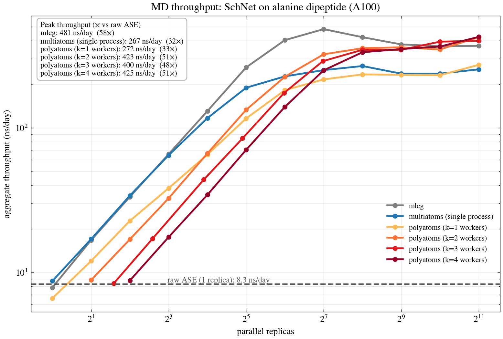

<p align="center">
  
</p>

<p align="center">
  <a href="https://github.com/aimat-lab/multi-atoms/actions/workflows/ci.yml">
    
  </a>
  <a href="LICENSE">
    
  </a>
</p>

Parallel, GPU-batched molecular dynamics (MD) on top of [ASE](https://wiki.fysik.dtu.dk/ase/).

ML potentials are fast per atom, but small systems underfill the GPU. Stepping
`N` copies in lockstep and batching their force evaluations turns `N` tiny
forward passes into one big one, which is where the throughput comes from.

The figure below shows where that lands. Throughput is measured on one A100 with
a SchNet model, alanine dipeptide, no solvent. Raw ASE manages 8.3 ns/day.
`MultiAtoms` takes that to 267 ns/day (32×), and `PolyAtoms` reaches ~423 ns/day
(51×). That is within ~12% of [mlcg](https://github.com/ClementiGroup/mlcg), a
fully GPU-native code, while every simulation stays a standard ASE object driven
by a standard ASE integrator.



> [!TIP]
> The near-linear rise at the left of the log-log plot is the GPU running
> under-occupied: while capacity is spare, each added replica buys close to its
> full throughput. The curve flattens where the GPU saturates.

`MultiAtoms` runs many MD simulations at once and batches their model
evaluations into a single forward pass. The simulations themselves are ordinary
ASE `Atoms` objects driven by an ordinary ASE integrator (Langevin, Velocity
Verlet, BFGS). A cooperative greenlet scheduler pauses each one when it needs
forces; once they have all yielded, it collects the pending systems, runs one
batched forward pass, and hands the results back. Nothing in that loop needs to
be GPU-native. The interception happens at `get_forces()`, so any ASE driver
that calls it is batched unchanged. A fully GPU-native engine reaches
comparable throughput only by rewriting the dynamics itself.

`PolyAtoms` extends this across processes. It runs several `MultiAtoms`
instances at once, so while one is blocked on its batched forward, the others
keep integrating on the CPU, which keeps the GPU busy.

> [!WARNING]
> Expect a more modest speedup if your systems are already large enough to
> saturate the GPU on their own, or if much of the per-step cost sits outside
> the model forward, such as graph building in `curate_batch`. See
> [docs/usage.md](docs/usage.md) for what batching does and does not cover.


## Install

With [pixi](https://pixi.sh) (recommended for development):

```bash
pixi install
pixi run test
```

Or as a dependency of another project (editable path dep):

```toml
# pixi.toml
[pypi-dependencies]
multiatoms = { path = "../multi-atoms", editable = true }
```

Or straight from git:

```bash
pip install "multiatoms @ git+https://github.com/aimat-lab/multi-atoms.git"
```

Runtime dependencies: `ase`, `numpy`, `greenlet`, `torch`.

## Concepts

| Class          | Role                                                                              |
| -------------- | -------------------------------------------------------------------------------- |
| `MultiAtoms`   | Owns `n_systems` `BatchedAtoms` and exposes `map` / `foreach` / `parallel()`.     |
| `BatchedAtoms` | An ASE `Atoms` subclass whose `get_forces()` yields to the scheduler in parallel. |
| `ModelManager` | Abstract base you subclass to turn a batch of systems into model inputs/outputs.  |
| `HubScheduler` | Trampoline (star-topology) greenlet scheduler; O(1) stack depth regardless of N.  |
| `PolyAtoms`    | Runs `workers` `MultiAtoms` in separate processes sharing one GPU force server.   |

## Quickstart

You implement one method, `curate_batch`, to describe how a list of systems
becomes a batched model input. Everything else (caching, scheduling, result
distribution) is handled for you. Full walkthrough in
[docs/usage.md](docs/usage.md).

```python
multi = MultiAtoms(template="system.pdb", model_manager=manager, n_systems=64)
integrators = multi.map(lambda a: Langevin(a, ...), multi.atoms)

# inside parallel(), get_forces() across all systems is one batched GPU pass
with multi.parallel():
    multi.foreach(lambda i: i.run(1000), integrators)
```

## Contributing

Issues and pull requests are welcome, including questions and "this part was
confusing" reports, not just code. If you wire up a `ModelManager` for a real
MLIP, hearing what worked and what the speedup looked like on your hardware is
especially useful.

Before opening a PR:

```bash
pixi run test           # pytest
pixi run lint           # ruff check
pixi run format         # ruff format (writes)
pixi run format-check   # ruff format --check (what CI gates on)
```

CI runs the same checks on every pull request.

## License

MIT, see [LICENSE](LICENSE).
